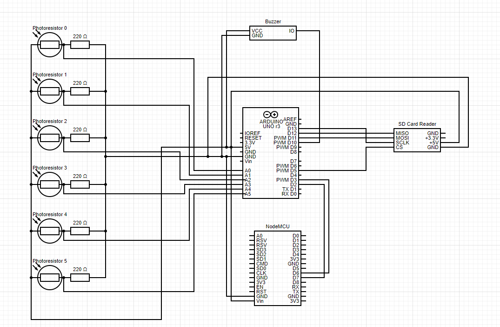

# Light piano
This repository contains the code for a piano with 6 notes controlled by light. In addition, the piano can play 8 bit songs that are stored on an SD card.

### Electrical scheme

### Arduino code
The arduino code is in the 'light_piano' folder.
The piano part is handled by the 2 functions:
* init_piano that initializes the pins and sets the frequencies of each note to C4, D4, E4, F4, G4, A4. Also, it reads the values from the photoresitors once to calibrate them to ambiental light.
* handle_piano - reads the values from all photoresistors and picks the one with the maximum deviation from it's calibartion value. If the deviation exceedes a certain threshold, then it plays the note.

Besides the piano part, the arduino sends the list of files on the software serial interface and the listens for a filename. When it receives one, it plays that file from the SD card.

### NodeMCU code
The nodemcu code is in the 'ligh_piano_nodemcu' folder.

The Nodemcu connects to my Wifi network and opens a web server with 2 endpoints:
* / GET - returns a page with a dropdown containing the list of files on the sd card.
* /play POST - Sends the filename received by parameter to the arduino through the software serial interface. 

### Song parsing
In the 'song_parser' directory there is a python script that converts a song from this repository (https://github.com/robsoncouto/arduino-songs) to a binary file that can be played by the arduino.

The melody array should be placed in the 'input.txt' file without any comments. Then, the script asks for a filename that should not contain spaces and should have maximum 8 characters. After running, it will output a binary file that can be copied to the sd card.